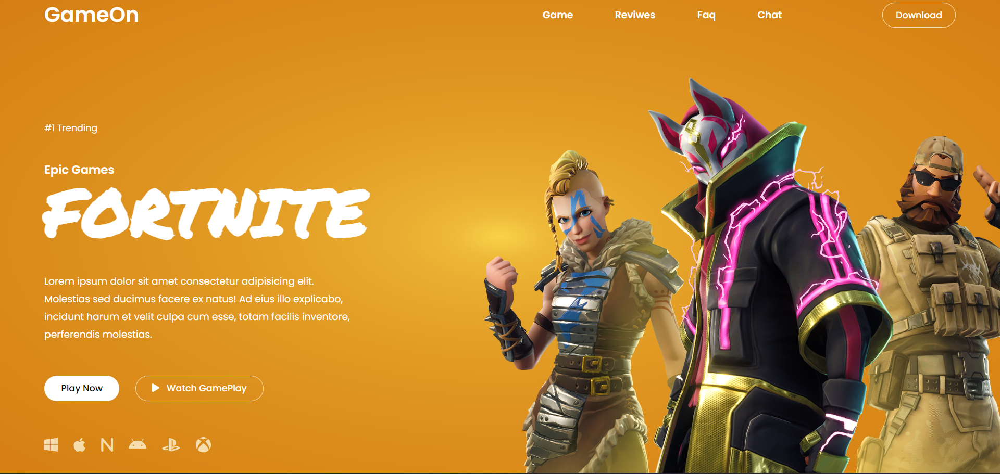

# Landing Page Fortnite

Este é um projeto simples de Landing Page para o Fortnite, desenvolvido como parte do treinamento em programação utilizando HTML e CSS.

## Screenshot

Aqui está uma captura de tela do projeto:




## Descrição do Projeto

A Landing Page oferece uma visão geral básica do universo Fortnite, apresentando informações sobre modos de jogo, personagens e um design responsivo para uma experiência amigável em diferentes dispositivos.

## Tecnologias Utilizadas

- HTML5
- CSS3

## Instruções de Uso

1. Faça o clone deste repositório.
   ```bash
   git clone https://github.com/BrunoFelixDeSousa/fortnite-landing-page.git
   ```

2. Abra o arquivo `index.html` em seu navegador para visualizar a Landing Page.

## Estrutura do Projeto

```
landing-page-fortnite/
│
├── index.html
├── css/
│   └── style.css
├── img/
│   ├── anime.jpg
│   └── ...
└── README.md
```
## Créditos

Este projeto foi inspirado em um tutorial encontrado no YouTube. Agradeço [Tahmid Ahmed](https://www.youtube.com/watch?v=FJ9UtGfVkcI&list=WL&index=8) por compartilhar o conhecimento. Certifique-se de conferir o vídeo original para obter uma visão mais detalhada do projeto.
